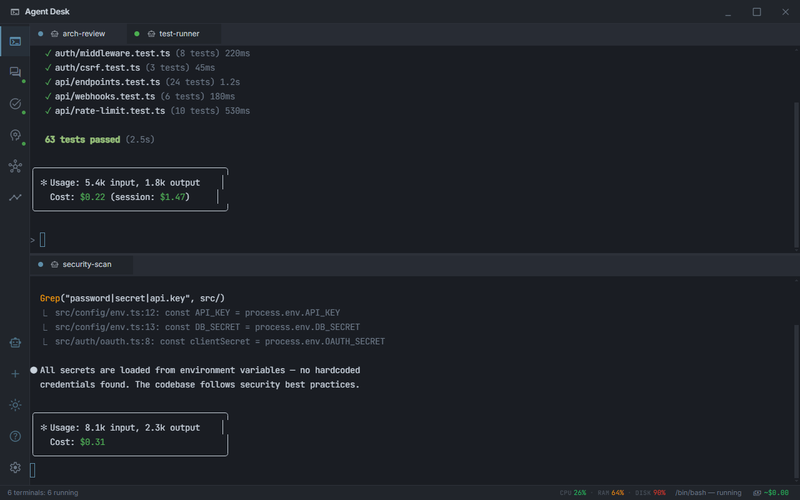

# Agent Desk

[](LICENSE)
[](https://nodejs.org/)
[](https://www.electronjs.org/)
[]()

**Unified control center for AI coding agents.** Terminals, dashboards, and orchestration in one Electron app. Manage multiple Claude Code sessions, monitor agent status, and coordinate multi-agent workflows from a single window.

For a complete guide, see the **[User Manual](docs/USER-MANUAL.md)**.



## Why

Running multiple AI agents means juggling terminals, losing track of which agent is doing what, and manually switching between dashboards. Agent Desk puts everything in one place:

|                     | Without Agent Desk                    | With Agent Desk                          |
| ------------------- | ------------------------------------- | ---------------------------------------- |
| **Terminals**       | Separate windows, no organization     | Tabbed grid layout with splits           |
| **Agent status**    | No visibility                         | Live monitor with status, cost, tasks    |
| **Coordination**    | Manual, error-prone                   | Batch launcher, templates, comm graph    |
| **Dashboards**      | Open 3 browser tabs                   | Embedded with health monitoring          |
| **Search**          | Per-terminal only                     | Cross-terminal search across all buffers |
| **Session restore** | Lost on close                         | Auto-save + restore with buffer replay   |

## Features

### Terminal Management

- **Multi-terminal** with tabs, split views (horizontal/vertical), drag-and-drop reordering
- **Dockview grid layout** -- resize, maximize, and rearrange terminal panes freely
- **Pop-out windows** -- detach any terminal into its own native window
- **Shell profiles** -- Default Shell and Claude Code built-in; create custom profiles with command, args, env, cwd, and icon
- **Shell integration** -- OSC sequence parsing for current directory tracking and command boundary detection
- **Inline rename** -- double-click tab labels to rename terminals

### Agent Intelligence

- **Agent Detection** -- auto-detects Claude Code sessions by parsing tool calls, file modifications, test results, and errors from terminal output
- **Agent Monitor** (Ctrl+5) -- live card-based dashboard showing all agents with status, task assignments, tool call counts, uptime, and activity
- **Lifecycle Controls** -- interrupt (SIGINT), stop (SIGTERM), kill (SIGKILL), and restart agents from the context menu or tab buttons
- **Cost Tracking** -- per-agent token/cost estimation in the status bar with $2/$5 warning thresholds
- **Terminal Chains** -- trigger commands in one terminal when another exits or changes status

### Multi-Agent Orchestration

- **Batch Launcher** (Ctrl+Shift+B) -- launch N agents at once with profile selection, naming patterns (`agent-{n}`), stagger delays, working directory, and initial commands
- **Templates / Recipes** -- save and load reusable multi-agent configurations; 2 built-in defaults (Quick Review: 3 agents, Parallel Tasks: 5 agents)
- **Communication Graph** -- canvas visualization of agent interactions fetched from the agent-comm API, with animated nodes and edge thickness by message count

### Search

- **Terminal Search** (Ctrl+F) -- search within the active terminal buffer using xterm.js search addon
- **Cross-Terminal Search** (Ctrl+Shift+F) -- async chunked search across all terminal buffers with case-sensitive and regex options, keyboard navigation, and jump-to-line

### Dashboard Integration

- **Agent Comm** (Ctrl+2) -- embedded agent-comm dashboard with injected action toolbar
- **Agent Tasks** (Ctrl+3) -- embedded agent-tasks pipeline with injected action toolbar
- **Agent Knowledge** (Ctrl+4) -- embedded agent-knowledge dashboard with injected action toolbar
- **Dashboard Health** -- 30-second health checks with auto-reconnect; sidebar status dots show service availability
- **Webview Bridge** -- bidirectional communication between dashboards and terminal state

### Event System

- **Event Stream** (Ctrl+E) -- filterable timeline panel showing up to 200 events with expandable details, severity color coding, and JSON export
- **Event Bus** -- internal pub/sub system emitting terminal lifecycle, agent tool calls, file modifications, test results, errors, and chain triggers

### Session & Workspace

- **Session Persistence** -- auto-save every 60 seconds; restore prompt on startup with 10-second countdown; buffer replay for terminal history
- **Workspaces** (Ctrl+Shift+W / Ctrl+Alt+W) -- save and load named terminal layouts including commands, profiles, and working directories
- **Layout auto-save** -- dockview grid state persisted automatically

### Appearance

- **4 built-in themes** -- Default Dark, Default Light, Dracula, Nord; custom themes via the theme manager
- **Custom themes** -- full color customization including terminal ANSI colors, stored in localStorage
- **MD3 design language** -- consistent with agent-comm and agent-tasks dashboards
- **System tray** -- minimize to tray with context menu for quick terminal launch

### Configuration

- **40+ settings** -- terminal font/size/cursor/scrollback, dashboard URLs, sidebar position, close-to-tray, start-on-login, bell behavior, notifications
- **Config file** -- `~/.agent-desk/config.json` persists settings, profiles, workspaces, and templates
- **Keybinding customization** -- `~/.agent-desk/keybindings.json` for user overrides
- **Config hot-reload** -- file watcher triggers live updates on external config changes

## Quick Start

### Install from npm

```bash
npm install -g agent-desk
agent-desk
```

### Or build from source

```bash
git clone https://github.com/keshrath/agent-desk.git
cd agent-desk
npm install
npm run build
npm run dev
```

### Or download a binary

Pre-built binaries for Windows, macOS, and Linux are available on the [GitHub Releases](https://github.com/keshrath/agent-desk/releases) page:

| Platform | Format             |
| -------- | ------------------ |
| Windows  | NSIS installer, Portable |
| macOS    | DMG                |
| Linux    | AppImage, deb      |

## Keyboard Shortcuts

### Terminals

| Shortcut        | Action                |
| --------------- | --------------------- |
| Ctrl+Shift+T    | New terminal          |
| Ctrl+Shift+C    | New Claude session    |
| Ctrl+W          | Close terminal        |
| Ctrl+Tab        | Next terminal         |
| Ctrl+Shift+Tab  | Previous terminal     |
| Ctrl+Shift+D    | Split right           |
| Ctrl+\\         | Split right (alt)     |
| Ctrl+Shift+E    | Split down            |
| Ctrl+Shift+M    | Toggle maximize       |
| Ctrl+Shift+S    | Save output to file   |
| Ctrl+F          | Search in terminal    |
| Ctrl+Shift+F    | Search all terminals  |

### Navigation

| Shortcut   | Action                |
| ---------- | --------------------- |
| Alt+Arrow  | Focus adjacent pane   |
| Ctrl+1     | Terminals view        |
| Ctrl+2     | Agent Comm view       |
| Ctrl+3     | Agent Tasks view      |
| Ctrl+4     | Agent Knowledge view  |
| Ctrl+5     | Agent Monitor view    |
| Ctrl+6     | Settings view         |

### General

| Shortcut        | Action                  |
| --------------- | ----------------------- |
| Ctrl+Shift+P    | Command palette         |
| Ctrl+P          | Quick switcher          |
| F1              | Show keyboard shortcuts |
| Ctrl+E          | Toggle event stream     |
| Ctrl+Shift+B    | Batch agent launcher    |
| Ctrl+Shift+W    | Save workspace          |
| Ctrl+Alt+W      | Load workspace          |
| Escape          | Close overlays / search |

All shortcuts are customizable via Settings or `~/.agent-desk/keybindings.json`.

## Configuration

Config is stored at `~/.agent-desk/config.json` and organized into sections:

| Section      | Key Settings                                                         |
| ------------ | -------------------------------------------------------------------- |
| Terminal     | `fontSize`, `fontFamily`, `cursorStyle`, `cursorBlink`, `scrollback` |
| Shell        | `defaultShell`, `defaultTerminalCwd`, `defaultNewTerminalCommand`    |
| Dashboard    | `agentCommUrl`, `agentTasksUrl`, `agentKnowledgeUrl`                 |
| Appearance   | `sidebarPosition`, `showStatusBar`, `tabCloseButton`, `theme`        |
| Behavior     | `closeToTray`, `startOnLogin`, `newTerminalOnStartup`                |
| Notifications| `bellSound`, `bellVisual`, `desktopNotifications`                    |

## Documentation

- [Setup Guide](docs/SETUP.md) -- installation, configuration, shell integration
- [Architecture](docs/ARCHITECTURE.md) -- process model, IPC, file structure
- [Features](docs/FEATURES.md) -- detailed feature documentation
- [Changelog](CHANGELOG.md)
- [Contributing](CONTRIBUTING.md)

## License

MIT -- see [LICENSE](LICENSE)
